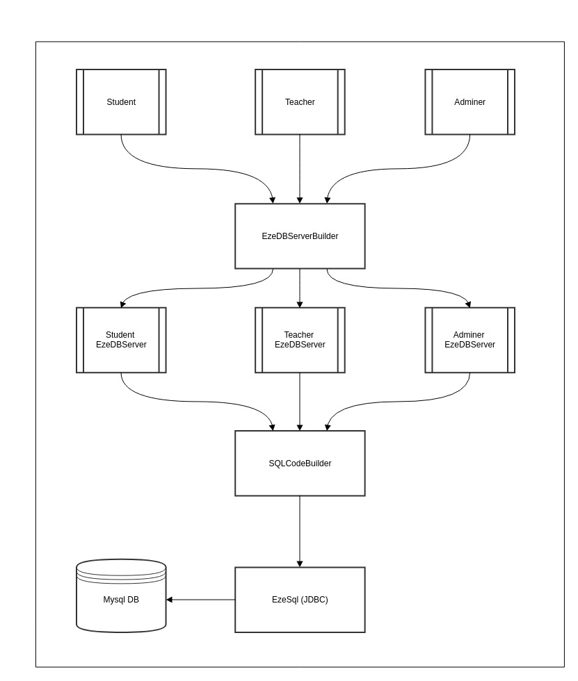

# EzeOrm 简介

EzeOrm 是一个使用java 编写的简易ORM（Object Relational Mapping 对象关系映射）框架。 关于ORM框架的简介请参考  [对象关系映射——维基百科](https://zh.wikipedia.org/wiki/%E5%AF%B9%E8%B1%A1%E5%85%B3%E7%B3%BB%E6%98%A0%E5%B0%84) 。帮助程序员更加简单的将自己的java 程序与数据库相连接。

## 数据库支持
 - 暂只支持 Mysql

## 项目状态
### 已实现功能
 - 注解
    - 主键注解（支持多个主键）
    - 自增注解
    - 非空注解
    - 实体类注解
    - 数据表列注解
 - 数据表的创建
 - 数据的增加
    - 单行插入
    - 多行插入
 - 数据的查找
    - 全部查找
    - 按条件查找
 - 数据的删除
    - 单行数据删除
    - 按条件删除
    - 整个数据表删除
 - 数据的更新
 - Sql语句的调用
 - 表结构更新
 
### 未实现
 - 外键
 - 其他特性...
 
# 使用示例
### 引入EzeOrm
 - 使用`maven`

        <repositories>
            <repository>
                <idd>jitpack.io</idd>
                <url>https://jitpack.io</url>
            </repository>
        </repositories>
        
        ......
        
        <dependencies>
        
            ......
            
            <dependency>
                <groupId>com.github.Ericwyn</groupId>
                <artifactId>EzeOrm</artifactId>
                <version>V1.1.1</version>
            </dependency>
            
            ......
            
        </dependencies>
	
 - 使用`jar`包
 
    - [EzeOrm_releases](https://github.com/Ericwyn/EzeOrm/releases)	
    
### 引入JDBC驱动
 - 省略
 
### 创建Entity实体类

    import com.ericwyn.ezeorm.annotation.AutoIncrement;
    import com.ericwyn.ezeorm.annotation.Column;
    import com.ericwyn.ezeorm.annotation.ColumnType;
    import com.ericwyn.ezeorm.annotation.Entity;
    import com.ericwyn.ezeorm.annotation.PrimaryKey;
    
    import java.util.Date;
    
    /**
     *
     * user的实体类
     * Created by Ericwyn on 17-11-20.
     */
    @Entity(table = "user")
    public class User {
    
        @PrimaryKey
        @AutoIncrement
        @Column(type = ColumnType.INT)
        private Long idd;
    
        @Column(type = ColumnType.TEXT,notNull = true)
        private String name;
    
        @Column(type = ColumnType.INT,notNull = true)
        private int age;
    
        @Column(type = ColumnType.TEXT,notNull = true)
        private String sex;
    
        @Column(type = ColumnType.DATETIME,notNull = true)
        private Date timeStamp;
    
        @Column(type = ColumnType.INT)
        private boolean good;
    
        public User() {
    
        }
        
        //省略的Getter 和 Setter 方法
    
    }

### 创建EzeDbServer并使用

    package com.ericwyn.ezeorm;
    
    import com.ericwyn.ezeorm.entity.Admin;
    import com.ericwyn.ezeorm.entity.User;
    import java.util.Date;
    import java.util.List;
    
    /**
     * Created by Ericwyn on 17-11-20.
     */
    public class Main {
        public static void main(String[] args) throws Exception{
            //创建EzeDbServer
            EzeDbServer<User> userServer=new EzeDbServer.Builder<User>()
                    .setEntityClass(User.class)
                    .create();
            EzeDbServer<Admin> adminServer=new EzeDbServer.Builder<Admin>()
                    .setEntityClass(Admin.class)
                    .create();
    
            //后续的增删改查操作
            //......
            
        }
    }
    
### 插入数据
    //单条数据插入
    User user=new User();
    user.setName("girlName2");
    user.setAge(15);
    user.setTimeStamp(new Date());
    user.setSex("girl");
    user.setGood(false);

    userServer.insert(user);
    
    //插入多条数据
    ArrayList<User> userList=new ArrayList<>();
    for (int i=0;i<10;i++){
        User listUserTemp=new User();
        listUserTemp.setName("userNameTemp"+i);
        listUserTemp.setAge(i);
        listUserTemp.setTimeStamp(new Date());
        listUserTemp.setSex("girl");
        listUserTemp.setGood(false);
        userList.add(listUserTemp);
    }

    userServer.insertList(userList);
    
### 查询数据

    //查询所有数据
    List<User> allUser = userServer.findAll();
    for (User userTemp:allUser){
        System.out.println(userTemp.getId()+" "+userTemp.getName()+" "+userTemp.getSex()+" "
                +userTemp.getAge()+" "+userTemp.getTimeStamp()+" "+userTemp.isGood());
    }

    //自定义条件查询
    List<User> allGirl = userServer.findByAttributes("sex = 'girl'");
    for (User userTemp:allGirl){
        System.out.println(userTemp.getId()+" "+userTemp.getName()+" "+userTemp.getSex()+" "
                +userTemp.getAge()+" "+userTemp.getTimeStamp());
    }

    //多条件查询
    List<User> allGirl2=userServer.findByAttributes("sex = 'girl'","age > 11");
    for (User userTemp:allGirl2){
        System.out.println(userTemp.getId()+" "+userTemp.getName()+" "+userTemp.getSex()+" "
                +userTemp.getAge()+" "+userTemp.getTimeStamp());
    }
    
 - 注 1：自定义条件查询、多条件查询当中的条件参数，需与MySql查询语句WHERE后条件语句写法一致

### 删除数据

    //删除单条数据
    List<User> allGirl = userServer.findByAttributes("idd=1");
    for (User userTemp:allGirl){
        userServer.delete(userTemp);
    }
    
    //自定义条件删除
    userServer.deleteByAttributes("sex ='boy'");
    
    //多条件删除
    userServer.deleteByAttributes("sex ='boy'","age >= 15");
    
    //删除表中所有数据
    userServer.deleteAll();
    
    //删除列表 （不推荐使用该方法，推荐使用多条件删除）
    List<User> allGirl=userServer.findByAttributes("sex = 'girl'");
    userServer.deleteList(allGirl);

    //删除该数据表
    userServer.dropTable();
    
 - 注 1：删除单条数据时候，会根据传入的 Entity 对象所有属性构建删除的SQL语句，所以有可能无法构造出一个与数据库中的某一列完全映射的实体类对象。所以使用这个方法时候，推荐是先通过查询方法获取实体类对象之后在将其作为参数传入
 - 注 2：一般情况下更推荐使用传入条件限定语句进行删除操作
 - 注 3：自定义条件删除、多条件删除当中的条件参数，需与MySql删除语句WHERE后条件语句写法一致
### 更新数据

    List<User> allGirlTemp = userServer.findByAttributes(" sex ='girl' ");
    for (User userTemp:allUser){
        userTemp.setSex("boy");
        userServer.update(userTemp);
        
    }

 - 注 1：使用该方法更新数据的时候，会先判断传入的对象是否有主键标记的属性，以及该属性下面的值，所以使用该方法的时候，推荐尽量先通过find方法查询到的相应的对象，修改了对象的属性之后再传入，以此完成修改。

### 调用Sql语句
EzeOrm框架进行了简单封装帮助用户直接运行sql语句，其中一个方法会返回`runQuery(String sqlCode)`将不会有返回值，而`runQueryForRes(String sqlCode)`将会返回 `ResultSet` 对象

    userServer.runQuery("DROP TABLE user");
    ResultSet resultSet = userServer.runQueryForRes("SELECT * FROM user ");

### 解析ResultSet
EzeOrm 封装了一个`parseResultSet(ResultSet rs)`方法，能够帮助用户解析查询时候返回的ResultSet

    ResultSet resultSet = userServer.runQueryForRes("SELECT * FROM user ");
    List<User> users = userServer.parseResultSet(resultSet);
    for (User user:users){
        System.out.println(user.getName());
    }

## 对象关系映射表
### **mysql**里的映射
    
|    java 类型    | mysql 类型 |
| :--: | :--: |
| int、Integer、byte、Byte、short、Short、long、Long、Boolean、boolean |  INT |
| Long       |  BIGINT |
| float、Float、double、Double       |  DOUBLE |
| Date       |  DATETIME |
| char Char String       |  TEXT |

## 主要注解说明
### `@Entity`
 - 使用在类当中，标记实体类
 - `table` 属性设定表的名字
### `@Column`
 - 使用在类的变量当中，代表该类是数据表中的一个字段
 - 通过类的属性名转换获取对应数据表中的字段名字。
 - `type` 设定字段类型  （只能从ColumnType 中选择）
 - `notNull` 设定字段是否可为空 （默认为`false`,代表可为空）
### `@AutoIncrement`
 - 使用在类变量当中，代表该字段是自动增加的
### `@PrimaryKey`
 - 使用在类变量当中，代表该字段是主键
 

## 配置文件`ezeorm.cfg` 说明
整合ConfigGet工具进行配置文件的管理和读取, 关于该工具的更多信息可查看 [ConfigGet](https://github.com/Ericwyn/JavaUtil/blob/master/src/ConfigGet/README.md)

    db_connect_url = jdbc:mysql://localhost:3306/db_name?characterEncoding=utf-8&useUnicode=true    ; 数据库链接地址
    db_account = root           ; 数据库连接账号
    db_password = password      ; 数据库连接密码
    db_update_model = backup    ; 表结构更新的方式，详情查看下文中关于表结构更新的说明
    show_sql = true ; 显示 sql 代码，方便debug

# 主要架构设计备注
 - 通过`EzeDbServer.Builder` 创建EzeDbServer,每一个`Entity`类，绑定一个EzeDbServer ，而后再绑定一张数据表
 - 所有的`EzeDbServer` 共同使用`EzeSql`类，`EzeSql`是`EzeOrm`最底层的jdbc封装，所有的构建好的sql语句，直接在`EzeSql类`中执行。
 - 所以`EzeSql`类中，有所有类共用的`Connection` 和`Statement`，以及sql语句执行方法。
 - 各个实体类对象绑定的`EzeDbServer`，都要通过`MySQLCodeBuilder` 来生成增删改查使用的SQL语句，而后再传输到`EzeSql`的sql执行方法当中

# 其他说明
### 关于表结构更新
 - 表结构更新模式通过配置文件当中的`db_update_model`项设定，当前EzeOrm可选择的设置为参数为`no`或者`backup`
    - `db_update_model = no` 表示当表结构更新的时候不进行处理，而是抛出异常
    - `db_update_model = backup` 表示当表结构更新的时候，会重命名原来的表，而后新建一个新的表
 - 当前仅有一种表结构更新模式，即当表结构发生改变时候，会重命名旧的数据表（再其名称末尾加`x`，例如表`user`将会被重命名为`userx`），并且依据新的TableObj创建一个新的数据表。
 - 所以若进行表结构更新的话，推荐复制建立一个表结构映射类，而后通过`EzeOrm`框架操作进行旧表数据的迁移 
 
### 关于Entity类中属性的命名
 - 非 Boolean 或非 boolean 类型的变量统一使用驼峰发命名，如`registerDate`
 - Boolean 或者 boolean 类型的变量无需在变量名头部加入 `is` ，例如不能是`isGood`，而应该直接是`good`
 
### 关于编码格式以及中文乱码
 - 中文乱码一般与数据库的创建、表的创建、以及连接的 url 设置有关，EzeOrm 在创建表时候使用的是`UTF-8`编码
 - 推荐在建立数据库的时候设置 `CHARACTER` 为 `UTF-8` 以及 `COLLATE` 为 `utf8_general_ci`
 - 推荐在`ezeorm.cfg`当中设定 url 参数时候加上`?characterEncoding=utf-8&useUnicode=true`
 - 若还是遇到插入数据时候的中文乱码问题，参考一下[ubuntu中mysql修改编码utf8](http://blog.csdn.net/crave_shy/article/details/23345869)中的设置，将Mysql的默认编码格式改为`UTF-8`，具体修改如下
    - 打开mysql配置文件 `/etc/mysql/my.cnf` (Windows为安装目录下 复制`my-default.ini`后重命名为`my.ini`)
    - 增加以下内容

            [client]
            default-character-set=utf8

            [mysqld]
            character-set-server=utf8

            [mysql]
            default-character-set=utf8

### 关于 sql 注入的预防
 - 自于 EzeOrm 是直接用框架生成`sql`语句而后用`Statement` 的 `execute()`方法来完成数据库操作的，所以当增删改查过程中使用 `ByAttributes` 的时候可能存在被sql注入的危险（`ByAttributes`方法的参数直接对应了`sql`语句当中的 WHERE 限定语句），所以推荐使用的时候，在 Server 层增加对服务方法的参数修正，例如将参数的空格全部去除。

        public User getUserByMail(String mail) {
            List<User> users = server.findByAttributes("mail = '" + mail.replaceAll(" ","")+"'");
            if(users!=null && users.size()==1){
                return users.get(0);
            }else {
                return null;
            }
        }